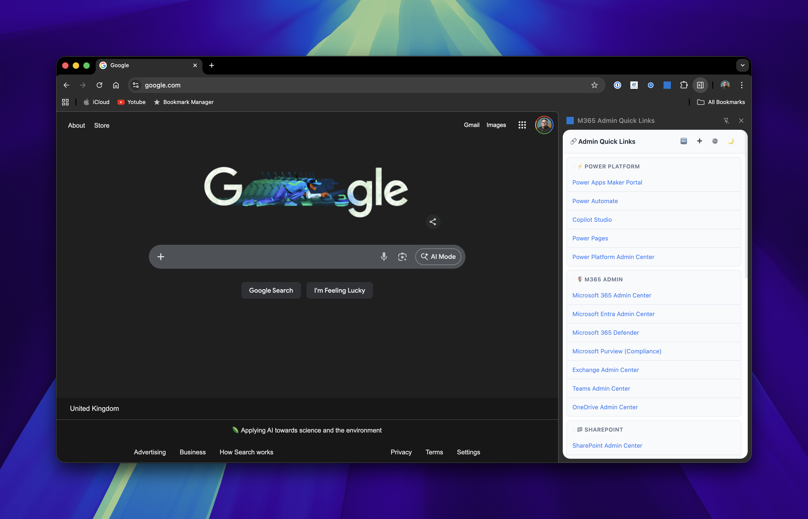
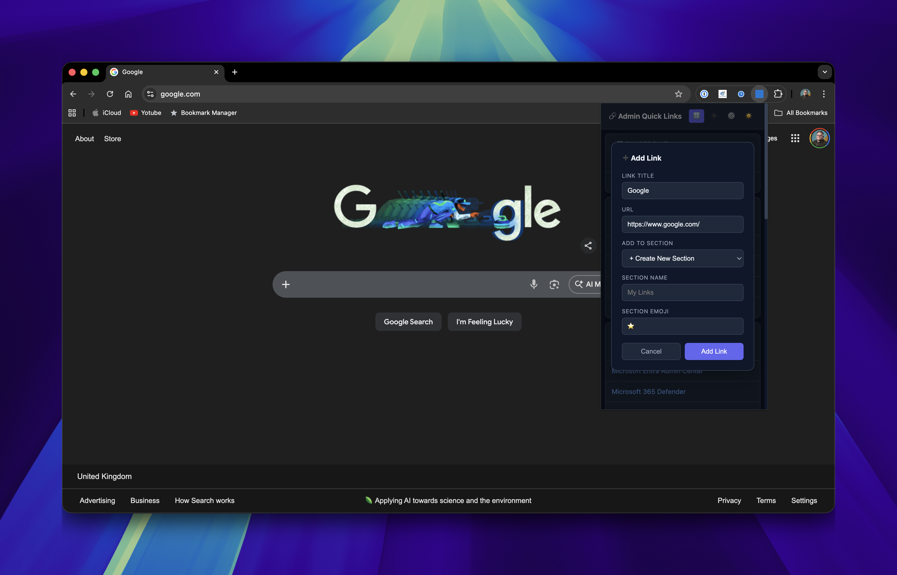
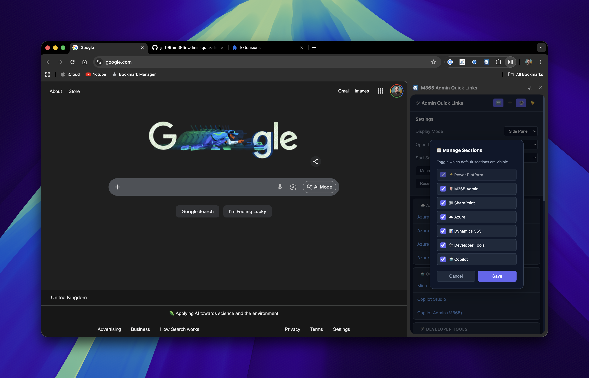
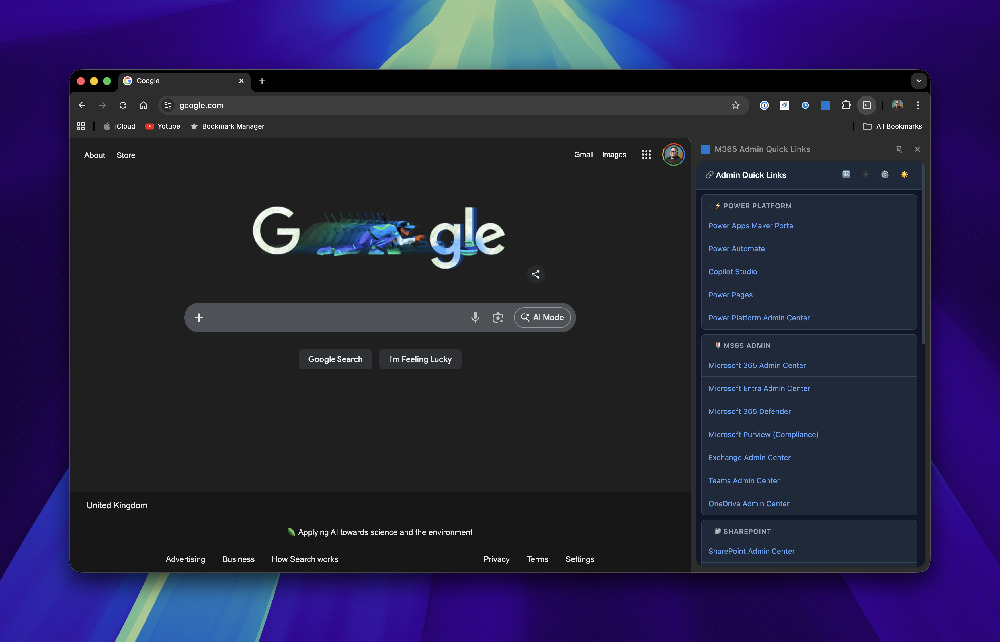
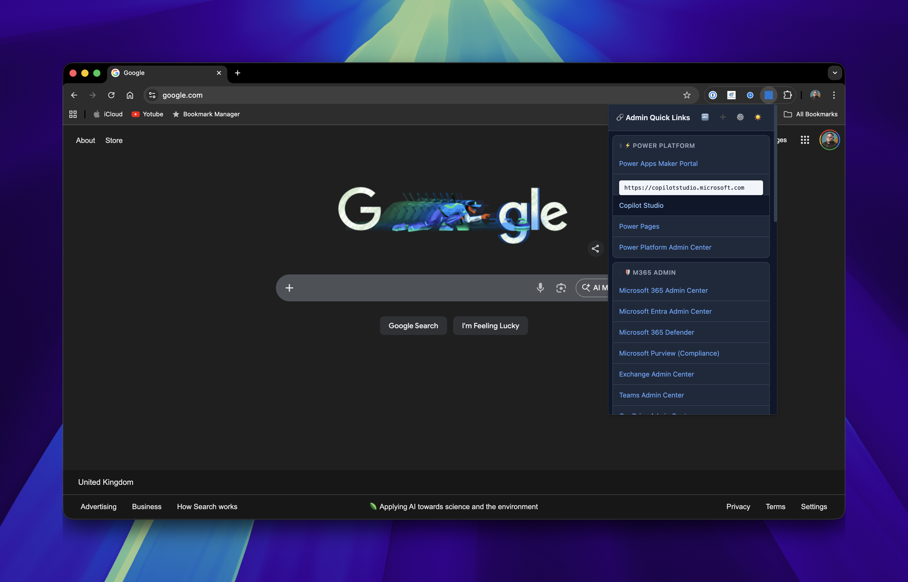
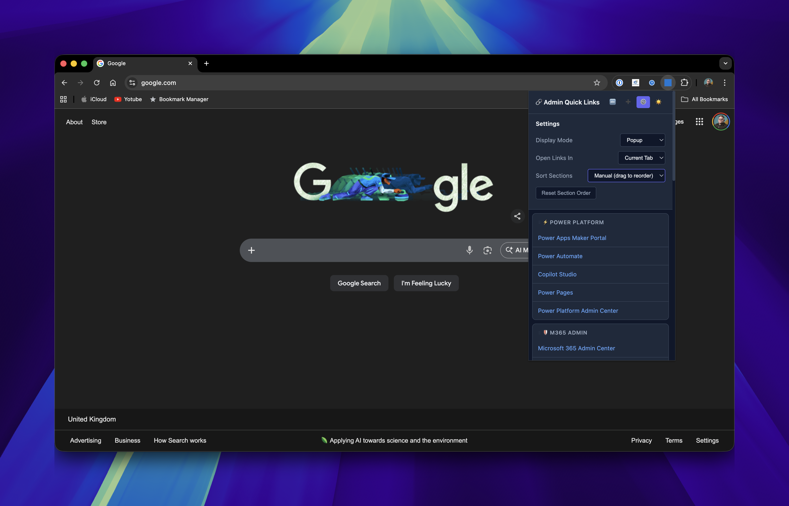

# M365 Admin Quick Links


A browser extension for **Chrome** and **Microsoft Edge** providing quick access to essential Microsoft 365 and Power Platform admin portals. Save time navigating between admin centers with one-click access to all your frequently used Microsoft portals.



## ✨ Features

### 🔗 Pre-configured Admin Portal Links
Instant access to essential Microsoft admin portals organized by category:

- **⚡ Power Platform** - Power Apps, Power Automate, Copilot Studio, Power Pages, Admin Center
- **🛡️ M365 Admin** - Microsoft 365 Admin, Entra, Defender, Purview, Exchange, Teams, OneDrive
- **📁 SharePoint** - SharePoint Admin Center, Tenant Lookup
- **☁️ Azure** - Azure Portal, DevOps, AI Studio, OpenAI Studio
- **📊 Dynamics 365** - Dynamics Home, Admin Center
- **🛠️ Developer Tools** - Graph Explorer, JWT Decoder, Connector Reference, Docs, Service Health
- **🤖 Copilot** - Microsoft Copilot, Copilot Studio, Copilot Admin

<details>
<summary><strong>📋 Complete List of Default Links (28 links)</strong></summary>

#### ⚡ Power Platform
| Link | URL |
|------|-----|
| Power Apps Maker Portal | https://make.powerapps.com |
| Power Automate | https://make.powerautomate.com |
| Copilot Studio | https://copilotstudio.microsoft.com |
| Power Pages | https://make.powerpages.microsoft.com |
| Power Platform Admin Center | https://admin.powerplatform.microsoft.com |

#### 🛡️ M365 Admin
| Link | URL |
|------|-----|
| Microsoft 365 Admin Center | https://admin.microsoft.com |
| Microsoft Entra Admin Center | https://entra.microsoft.com |
| Microsoft 365 Defender | https://security.microsoft.com |
| Microsoft Purview (Compliance) | https://purview.microsoft.com/home |
| Exchange Admin Center | https://admin.exchange.microsoft.com |
| Teams Admin Center | https://admin.teams.microsoft.com |
| OneDrive Admin Center | https://admin.onedrive.com |

#### 📁 SharePoint
| Link | URL |
|------|-----|
| SharePoint Admin Center | https://admin.microsoft.com/sharepoint |
| Tenant Lookup (ICANN) | https://lookup.icann.org |

#### ☁️ Azure
| Link | URL |
|------|-----|
| Azure Portal | https://portal.azure.com |
| Azure DevOps | https://dev.azure.com |
| Azure AI Studio | https://ai.azure.com |
| Azure OpenAI Studio | https://oai.azure.com |

#### 📊 Dynamics 365
| Link | URL |
|------|-----|
| Dynamics 365 Home | https://home.dynamics.com |
| Dynamics 365 Admin Center | https://admin.dynamics.com |

#### 🛠️ Developer Tools
| Link | URL |
|------|-----|
| Graph Explorer | https://developer.microsoft.com/en-us/graph/graph-explorer |
| JWT Decoder (jwt.ms) | https://jwt.ms |
| Connector Reference | https://learn.microsoft.com/en-us/connectors/connector-reference/ |
| Power Platform Docs | https://learn.microsoft.com/en-us/power-platform/ |
| Microsoft Graph Docs | https://learn.microsoft.com/en-us/graph/ |
| Service Health Status | https://status.office.com |

#### 🤖 Copilot
| Link | URL |
|------|-----|
| Microsoft Copilot | https://copilot.microsoft.com |
| Copilot Studio | https://copilotstudio.microsoft.com |
| Copilot Admin (M365) | https://admin.microsoft.com/Adminportal/Home#/copilot |

</details>

### ➕ Custom Sections & Links
Add your own frequently used links organized into custom sections:
- Click the **➕** button to add the current tab as a link
- Create new sections with custom names and emojis
- Add links to existing custom sections
- Remove individual links or entire sections



### 🎨 Display Options
- **Dark Mode** - Toggle between light and dark themes
- **Popup or Side Panel** - Use as a popup or pin as a side panel
- **Drag & Drop Reordering** - Arrange sections in your preferred order
- **Alphabetical Sorting** - Sort sections A-Z or Z-A

### ⚙️ Settings
Access the settings panel to configure:
- Display mode (Popup / Side Panel)
- Link opening behavior (New Tab / Current Tab)
- Section sorting (Manual / Alphabetical)
- **Manage Sections** - Show/hide default sections based on your needs
- Reset section order



## 📥 Installation

### From Source (Developer Mode)

#### Chrome
1. Clone the repository:
   ```bash
   git clone https://github.com/jsl1995/m365-admin-quick-links.git
   ```
2. Open Chrome and navigate to `chrome://extensions/`
3. Enable **Developer mode** using the toggle in the top right corner
4. Click **Load unpacked**
5. Navigate to and select the cloned `m365-admin-quick-links` folder
6. The extension will now appear in your toolbar - click the puzzle icon and pin it for easy access

#### Microsoft Edge
1. Clone the repository:
   ```bash
   git clone https://github.com/jsl1995/m365-admin-quick-links.git
   ```
2. Open Edge and navigate to `edge://extensions/`
3. Enable **Developer mode** using the toggle in the left sidebar
4. Click **Load unpacked**
5. Navigate to and select the cloned `m365-admin-quick-links` folder
6. The extension will now appear in your toolbar - click the puzzle icon and pin it for easy access

### From Chrome Web Store
*Coming soon*

### From Microsoft Edge Add-ons
*Coming soon*

## 🚀 Usage

### Opening the Extension
- **As Popup**: Click the extension icon in your toolbar
- **As Side Panel**: Enable in settings, then click the extension icon

### Adding Custom Links

1. Navigate to the page you want to save
2. Click the extension icon to open it
3. Click the **➕** button in the header
4. The current page's title and URL will be pre-filled
5. Choose to create a new section or add to an existing one
6. If creating a new section:
   - Enter a section name (e.g., "My Favorites")
   - Add an emoji (e.g., ⭐)
7. Click **Add Link**


### Managing Custom Sections

- **Reorder sections**: Drag sections by their header to rearrange
- **Delete a link**: Hover over a link in a custom section and click ✕
- **Delete a section**: Hover over a custom section header and click 🗑️

### Sorting Sections

- Click the **🔤** button to cycle through sort modes:
  - Manual (drag to reorder)
  - Alphabetical A-Z
  - Alphabetical Z-A

### Dark Mode

Click the **🌙** / **☀️** button to toggle between light and dark themes.

## 📸 Screenshots

| Light Mode | Dark Mode |
|------------|-----------|
|  |  |

| Settings | Side Panel |
|----------|------------|
|  |  |

| Manage Sections |
|-----------------|
|  |

## 🔒 Permissions

This extension requires the following permissions:

- **storage** - Save your preferences and custom links
- **sidePanel** - Enable side panel display mode
- **tabs** - Read current tab URL/title when adding custom links

## 🛠️ Development

### Project Structure
```
m365-links/
├── manifest.json      # Extension configuration
├── popup.html         # Main popup UI
├── popup.css          # Styles (light/dark themes)
├── popup.js           # Main application logic
├── sidepanel.html     # Side panel UI
├── background.js      # Service worker for display mode switching
├── icons/             # Extension icons
│   ├── icon16.png
│   ├── icon48.png
│   └── icon128.png
├── screenshots/       # Documentation screenshots
└── README.md
```

### Building
No build step required - this is a vanilla JavaScript extension.

### Testing
1. Make changes to the source files
2. Go to `chrome://extensions/`
3. Click the refresh icon on the extension card
4. Test your changes

## 📄 License

MIT License - feel free to use and modify as needed.

## 🤝 Contributing

Contributions are welcome! Feel free to:
- Report bugs
- Suggest new features
- Submit pull requests

## 📞 Support

If you encounter any issues or have questions, please open an issue on GitHub.

---

Made with ❤️ for Microsoft 365 Admins
